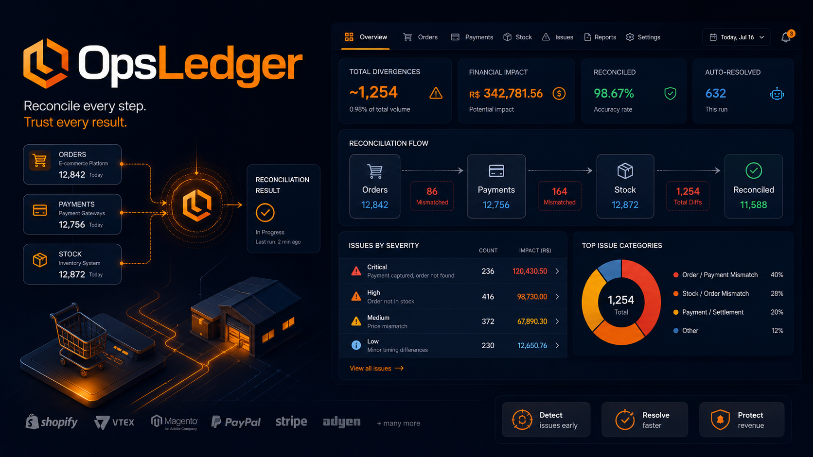
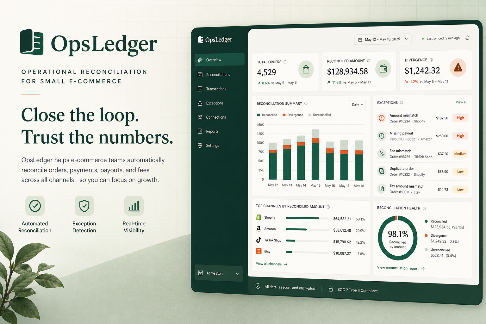
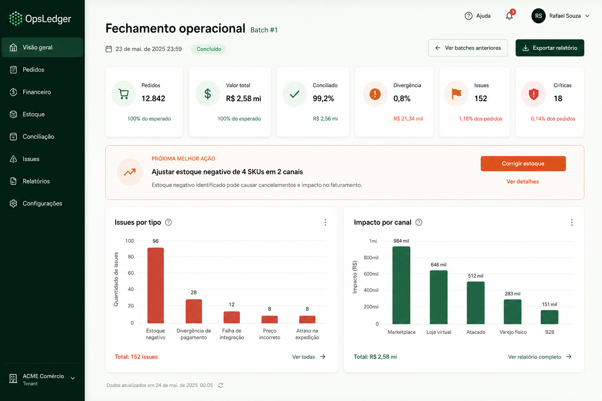
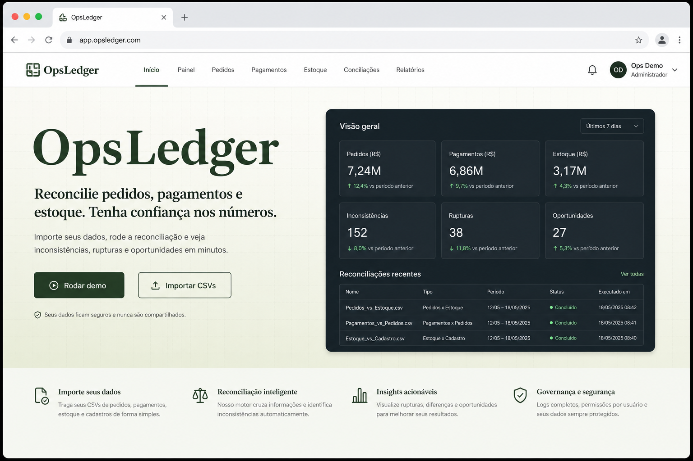
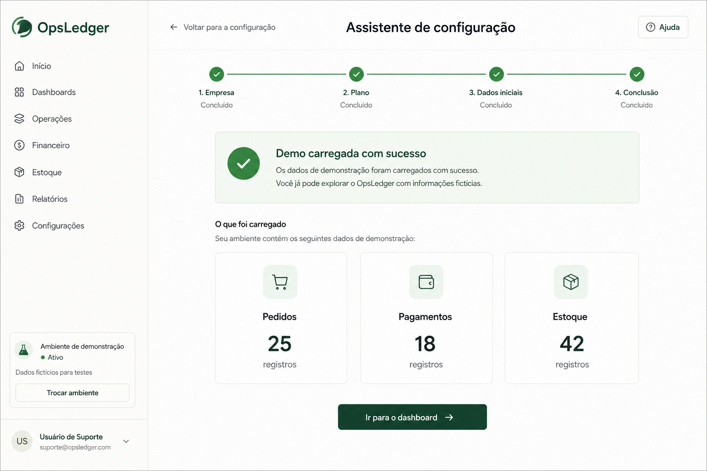
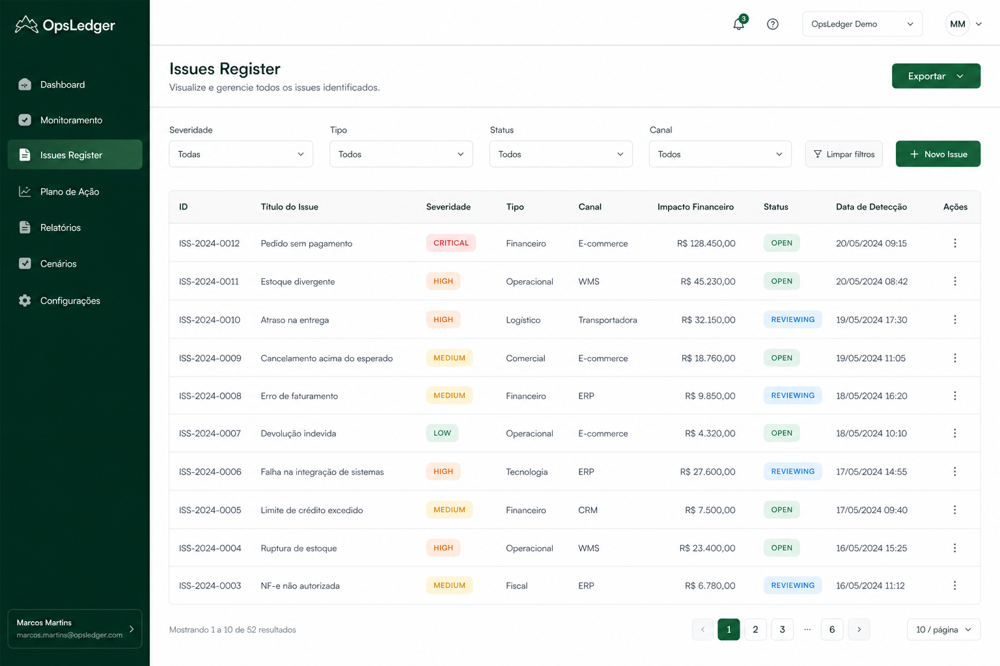
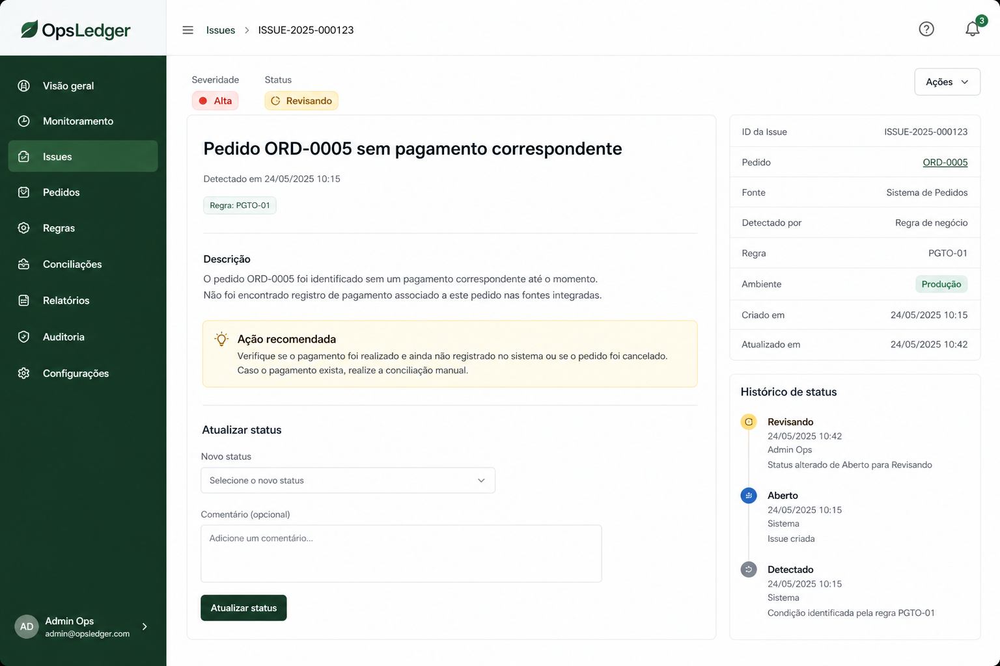
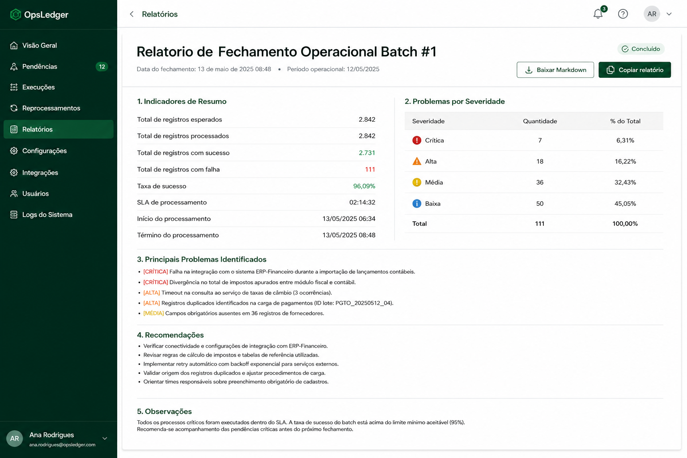
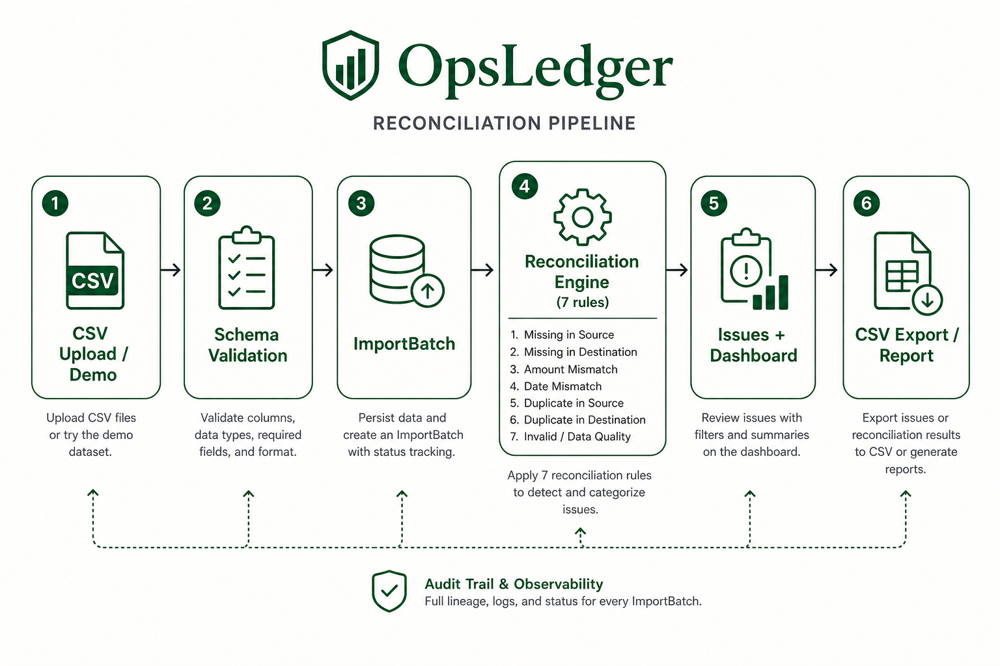

<div align="center">
  

  <h1>OpsLedger</h1>

  <p><strong>Reconciliação operacional de pedidos, pagamentos e estoque para pequenos e-commerces.</strong></p>
  <p><strong>Operational reconciliation of orders, payments and stock for small e-commerce teams.</strong></p>

  <p>
    <a href="#1-visão-geral--overview">PT-BR / English Overview</a> •
    <a href="#-product-preview">Preview</a> •
    <a href="#-screenshots">Screenshots</a> •
    <a href="#️-stack--tecnologias">Stack</a> •
    <a href="#-arquitetura--architecture">Architecture</a> •
    <a href="#-quick-start--início-rápido">Quick Start</a> •
    <a href="#-autor--author">Author</a>
  </p>

  <p>
    <a href="https://opsledger-app.vercel.app">
      
    </a>
    
    
    
    
    
    
  </p>
</div>

<p align="center">
  
</p>

---

## 1. Visão Geral / Overview

O **OpsLedger** é um produto de reconciliação operacional criado para transformar planilhas bagunçadas de pedidos, pagamentos e estoque em um fechamento confiável.

Ele automatiza um fluxo completo de **ingestão CSV, validação de schema, cruzamento de regras, cálculo de impacto financeiro, registro de issues, atualização de status, exportação e relatório executivo**. Em vez de tratar três exportações manuais como arquivos isolados, o OpsLedger as converte em um batch rastreável, com divergências priorizadas e próxima ação recomendada.

O projeto foi desenvolvido por **Felipe Alirio Baruja** como peça de portfólio, combinando engenharia full-stack, qualidade de dados e raciocínio de operação de e-commerce.

> **Product Scope Notice**  
> O OpsLedger é uma ferramenta de **reconciliação operacional**. Ele **não é** ERP, clone de marketplace, conciliação bancária completa nem sistema de estoque WMS.

---

## ✨ Product Preview

<p align="center">
  
</p>

O OpsLedger apresenta uma experiência executiva focada em confiança operacional: KPIs de conciliação, valor em divergência, issues por severidade, impacto por canal e callout de próxima melhor ação.

---

## 2. Por que este projeto importa? / Why this project matters

* **Planilhas são a realidade:** Pequenos e-commerces fecham a semana com exports manuais de pedidos, gateway e estoque. Cruzar isso com método é uma dor real.
* **Divergência sem impacto vira ruído:** O OpsLedger não só lista inconsistências — ele estima impacto financeiro e prioriza o que revisar primeiro.
* **Regras testáveis > dashboard decorativo:** Sete regras de reconciliação cobertas por testes unitários tornam o produto auditável e apresentável em entrevista.
* **Produto completo, não script solto:** API, UI, demo sintética, documentação e handoff de portfólio em um monorepo executável.

---

## 🧠 O diferencial do OpsLedger / What makes OpsLedger different

### Português
O OpsLedger não é apenas um dashboard. Ele combina validação de dados, engine de reconciliação e UX de investigação em uma experiência rastreável.

Ele mostra não apenas que “há problemas”, mas também:
- quanto dinheiro está em divergência;
- qual regra gerou cada issue;
- qual severidade e ação recomendada;
- quais canais concentram impacto;
- o que já foi revisado, resolvido ou ignorado;
- como exportar evidência para o gestor.

### English
OpsLedger is not just a dashboard. It combines data validation, a reconciliation engine and investigation UX into one traceable experience.

It shows not only that “there are problems”, but also:
- how much money is unreconciled;
- which rule produced each issue;
- severity and recommended action;
- which channels concentrate impact;
- what was reviewed, resolved or ignored;
- how to export evidence for stakeholders.

---

## 🎯 Problema que resolve / The problem it solves

No fechamento diário ou semanal, bases operacionais costumam chegar com:
- pedido `paid`/`shipped` sem pagamento correspondente;
- pagamento aprovado sem pedido;
- valores líquidos e capturas que não batem;
- `order_id` duplicado na exportação;
- venda sem baixa de estoque `out`;
- saldo estimado negativo por SKU;
- canais escritos como `whatsapp`, `zap`, `wpp`;
- baixa rastreabilidade do que foi revisado;
- relatórios manuais sem priorização por impacto.

O **OpsLedger** cria uma camada organizada entre o CSV bruto e a decisão operacional do fechamento.

---

## 🧩 Proposta / Reconciliation Pipeline

O OpsLedger processa três CSVs e entrega uma visão estruturada do batch, das divergências e do impacto financeiro:

```txt
CSV Upload / Demo Dataset
  ↓
Validação de schema (orders, payments, stock)
  ↓
ImportBatch (SQLite)
  ↓
Engine de reconciliação (7 regras)
  ↓
ReconciliationIssue + impacto financeiro
  ↓
Dashboard executivo
  ↓
Issues Register / status / timeline
  ↓
Export CSV + Relatório de fechamento
```

---

## 📸 Screenshots

<table>
  <tr>
    <td width="50%">
      
      <br />
      <sub><strong>Home</strong> — dor operacional, CTAs de demo e importação, preview executivo.</sub>
    </td>
    <td width="50%">
      
      <br />
      <sub><strong>Wizard / Demo</strong> — carga sintética, validação e preview dos três arquivos.</sub>
    </td>
  </tr>
  <tr>
    <td width="50%">
      
      <br />
      <sub><strong>Dashboard</strong> — KPIs, próxima ação, issues por tipo e impacto por canal.</sub>
    </td>
    <td width="50%">
      
      <br />
      <sub><strong>Issues Register</strong> — tabela filtrável por severidade, tipo, status e canal.</sub>
    </td>
  </tr>
  <tr>
    <td width="50%">
      
      <br />
      <sub><strong>Issue Detail</strong> — descrição, ação recomendada, status e timeline.</sub>
    </td>
    <td width="50%">
      
      <br />
      <sub><strong>Relatório</strong> — fechamento operacional em Markdown/HTML exportável.</sub>
    </td>
  </tr>
</table>

---

## 📄 Executive Report

<p align="center">
  
</p>

O relatório consolida indicadores do batch, issues por severidade, próxima melhor ação e top divergências em um artefato pronto para revisão de fechamento.

---

## 📌 Estudo de Caso / Case Study

### 📌 Estudo de Caso: Fechamento sintético de e-commerce omnichannel
A demo simula ~30 dias de operação com **152 pedidos**, **148 pagamentos** e **257 movimentações de estoque**, incluindo **~30 divergências intencionais** (pagamento ausente, órfão, mismatch de valor, duplicidade, baixa ausente, estoque negativo e canal não padronizado).

O OpsLedger valida os CSVs, cria um `ImportBatch`, executa as 7 regras e entrega dashboard com valor conciliado vs. em divergência, issues priorizadas e exportação para o gestor.

### 📌 Case Study: Synthetic omnichannel e-commerce close
The demo simulates ~30 days of operations with **152 orders**, **148 payments** and **257 stock movements**, including **~30 intentional divergences** (missing payment, orphan payment, amount mismatch, duplicates, missing stock-out, negative stock and channel standardization).

OpsLedger validates the CSVs, creates an `ImportBatch`, runs 7 rules and delivers a dashboard with reconciled vs. unreconciled amounts, prioritized issues and export for stakeholders.

---

## 🧭 Visual Story / Jornada Operacional

A experiência do OpsLedger foi pensada como uma jornada de fechamento guiada:

```txt
1. Abrir a home e escolher Rodar demo ou Importar CSVs
2. Validar schema e visualizar preview dos arquivos
3. Revisar o dashboard executivo do batch
4. Investigar issues por severidade / tipo / canal
5. Abrir detalhe, registrar nota e mudar status
6. Exportar CSV das issues
7. Gerar relatório de fechamento operacional
```

---

## ⚙️ Funcionalidades Principais / Core Features

### Demo & Upload Wizard
Carrega dados sintéticos realistas ou importa três CSVs com validação de colunas mínimas e mensagens de erro úteis.

### Reconciliation Engine
Sete regras testáveis: `missing_payment`, `orphan_payment`, `amount_mismatch`, `duplicate_order`, `missing_stock_out`, `negative_stock`, `channel_standardization`.

### Executive Dashboard
KPIs de pedidos, valor total, conciliado, divergência, quantidade de issues, severidade, gráficos e próxima melhor ação.

### Issues Register
Tabela filtrável com severidade, tipo, impacto financeiro e status (`open`, `reviewing`, `resolved`, `ignored`).

### Issue Detail + Timeline
Detalhe da divergência, ação recomendada, atualização de status com nota e histórico.

### Export & Report
Exportação CSV das issues e relatório Markdown/HTML de fechamento do batch.

---

## 🛠️ Stack / Tecnologias

### Frontend
- **Framework:** Next.js 15 (App Router) & React 19
- **Linguagem:** TypeScript
- **Estilização:** Tailwind CSS
- **Gráficos:** Recharts
- **Tabela:** TanStack Table
- **Validação client:** Zod

### Backend
- **Framework API:** FastAPI & Uvicorn (Python 3.12)
- **Modelagem:** Pydantic v2 + SQLAlchemy
- **Processamento:** Pandas
- **Banco (MVP):** SQLite (migração PostgreSQL documentada)
- **Testes:** Pytest + Vitest

---

## 🧱 Arquitetura / Architecture

O projeto adota um monorepo desacoplado:

```text
opsledger/
├── apps/
│   ├── web/                         # Frontend Next.js (App Router)
│   │   ├── src/app/                 # Home, wizard, dashboard, issues
│   │   ├── src/components/          # KPI, charts, badges, shell
│   │   ├── src/lib/                 # API client e helpers
│   │   └── src/types/               # Tipos TypeScript
│   │
│   └── api/                         # Backend FastAPI
│       ├── app/
│       │   ├── api/                 # Endpoints REST
│       │   ├── models/              # SQLAlchemy
│       │   ├── reconciliation/      # Engine de regras
│       │   ├── schemas/             # Pydantic
│       │   └── services/            # Import, validação, report
│       ├── scripts/                 # Geração de dados demo
│       └── tests/                   # Pytest da engine e API
│
├── data/
│   ├── demo/                        # CSVs sintéticos
│   └── processed/                   # Uploads processados
│
├── docs/                            # Arquitetura, regras, dicionário, deploy
├── assets/                          # Ícone, hero, screenshots, social preview
├── vercel.json                      # Vercel Services (web + FastAPI)
├── start.bat                        # Sobe API + web no Windows
├── HANDOFF_PORTFOLIO.md             # Texto pronto para portfólio
└── README.md                        # Esta documentação
```

---

## 🧱 Visual Architecture

<p align="center">
  
</p>

OpsLedger follows a traceable operational flow: raw CSV or demo dataset enters the pipeline, gets validated, batched, reconciled by explicit rules and exported as dashboard insights, issue register or closing report.

---

## 🔁 Data Flow Pipeline

```txt
Raw Input (demo / upload)
  ↓
CSV Parsing + Schema Validation
  ↓
ImportBatch persistence (SQLite)
  ↓
Reconciliation Engine (7 rules)
  ↓
Issue materialization + amount impact
  ↓
Dashboard aggregations
  ↓
Issue status workflow
  ↓
CSV export / Markdown-HTML report
```

---

## 🚀 Quick Start / Início Rápido

### Live Demo
Demo pública one-click: **[https://opsledger-app.vercel.app](https://opsledger-app.vercel.app)** → **Rodar demo**.

### Pré-requisitos
- **Node.js** v20 ou superior
- **Python** 3.12+
- **Git**

### Opção 1 — Windows (`start.bat`)

Na raiz do repositório:

```bash
.\start.bat
```

Sobe API (`8000`) + web (`3000`) e preserva o fluxo **Rodar demo** da home.

### Opção 2 — Manual

#### 1. Backend FastAPI (`apps/api`)

```bash
cd apps/api
python -m venv .venv
.venv\Scripts\activate            # Windows
source .venv/bin/activate          # Linux/macOS
pip install -r requirements.txt
python scripts/generate_demo_data.py
uvicorn app.main:app --reload --port 8000
```

API: [http://127.0.0.1:8000](http://127.0.0.1:8000) · Health: `/api/health` · Docs: `/docs`

#### 2. Frontend Next.js (`apps/web`)

```bash
cd apps/web
npm install
copy .env.example .env.local       # Windows
# cp .env.example .env.local       # Linux/macOS
npm run dev
```

Frontend: [http://localhost:3000](http://localhost:3000)

### Docker (opcional)

```bash
docker compose up --build
```

---

## 🧪 Scripts e Testes / Scripts and Testing

### Backend (Pytest)

```bash
cd apps/api
.venv\Scripts\python -m pytest -q
```

Cobertura mínima: 7 regras da engine + `/api/health` + `/api/demo/run`.

### Frontend (Vitest + typecheck + build)

```bash
cd apps/web
npm test
npm run typecheck
npm run lint
npm run build
```

CI: `.github/workflows/ci.yml` (pytest + vitest + lint + typecheck + build).

---

## 📐 Regras de Reconciliação / Reconciliation Rules

| Regra | Tipo | Severidade | Ideia |
|-------|------|------------|-------|
| 1 | `missing_payment` | high | Pedido pago/enviado sem pagamento aprovado |
| 2 | `orphan_payment` | high | Pagamento aprovado sem pedido |
| 3 | `amount_mismatch` | medium/high | Diferença > R$ 0,05 |
| 4 | `duplicate_order` | medium/high | `order_id` repetido inconsistente |
| 5 | `missing_stock_out` | medium | Venda sem baixa `out` |
| 6 | `negative_stock` | critical | Saldo simulado negativo |
| 7 | `channel_standardization` | low | Variações de canal (`zap`/`wpp`/…) |

Detalhamento: [`docs/reconciliation-rules.md`](docs/reconciliation-rules.md).

---

## 🛡️ Limitações Honestas / Honest Limitations

* Sem autenticação, multiempresa ou permissões avançadas
* SQLite single-user no MVP · no Vercel o DB é `/tmp` (demo efêmera)
* Dinheiro ainda em `float` (roadmap: `Decimal`) — KPIs abertos recalculam ao resolver issues
* Estoque é **simulação de saldo do batch**, não WMS
* Sem integração real com marketplace/gateway/banco
* Escopo deliberadamente fora de ERP / emissão fiscal / billing

---

## 🧭 Roadmap do Produto

* **Fase 0 — MVP local:** demo, upload, engine, dashboard, issues, export, report
* **Fase 1 — Persistência:** PostgreSQL + Alembic + histórico de batches
* **Fase 2 — Produto:** auth, workspaces por loja, regras configuráveis
* **Fase 3 — Matching:** fuzzy `order_id` entre canais e deduplicação avançada
* **Fase 4 — Operação:** alertas (Slack/e-mail) para issues críticas
* **Fase 5 — Comparativo:** semana a semana e tendência de divergência

---

## 💼 Valor para Portfólio / Portfolio Value

O OpsLedger demonstra competências críticas para **Analytics Engineering, Data/Ops Analytics e Full-Stack**:
- **Produto de dados aplicado:** dor real de fechamento operacional
- **Engine testável:** regras explícitas com pytest
- **Modelagem + SQLAlchemy:** batch, entidades e histórico de status
- **UX executiva:** investigação, priorização e handoff para gestor
- **Documentação de entrevista:** README + HANDOFF + docs técnicos

---

## 📚 Documentação Complementar

- [`HANDOFF_PORTFOLIO.md`](HANDOFF_PORTFOLIO.md) — textos prontos para portfólio, LinkedIn e entrevista
- [`docs/AUDIT_REPORT.md`](docs/AUDIT_REPORT.md) — auditoria do quality pass
- [`docs/HANDOFF.md`](docs/HANDOFF.md) — o que mudou neste pass
- [`docs/architecture.md`](docs/architecture.md) — arquitetura
- [`docs/TECHNICAL_DECISIONS.md`](docs/TECHNICAL_DECISIONS.md) — ADRs e trade-offs
- [`docs/TESTING.md`](docs/TESTING.md) — pirâmide de testes
- [`docs/reconciliation-rules.md`](docs/reconciliation-rules.md) — regras detalhadas
- [`docs/data-dictionary.md`](docs/data-dictionary.md) — tabelas e schemas CSV
- [`docs/demo-story.md`](docs/demo-story.md) — narrativa da demo
- [`docs/deployment.md`](docs/deployment.md) — Vercel / Docker / local

---

## 💼 O que este projeto demonstra

- **Produto de dados aplicado** a uma dor operacional real (fechamento com planilhas).
- **Engine testável** com regras explícitas (pytest) — não só dashboard.
- **Full-stack coerente:** validação → batch → KPIs → investigação → status → export.
- **Honestidade de escopo:** não é ERP, WMS nem conciliação bancária.
- **DX de portfólio:** demo one-click, CI, docs de entrevista, deploy público.

---

## 🎤 Como eu apresentaria em entrevista

1. **30s — dor:** Marina fecha a semana com 3 CSVs que não batem.
2. **Demo viva:** home → Rodar demo → dashboard (divergência + próxima ação).
3. **Issue crítica:** abrir detalhe, explicar a regra e a ação recomendada.
4. **Código:** abrir `engine.py` + um teste pytest — destacar pureza das regras.
5. **Trade-offs:** float money, SQLite `/tmp`, sem auth — e o que seria v1.1 (Decimal, Postgres, workspace).
6. **Posicionamento:** Analytics Engineering / Ops Analytics, não “fintech platform”.

---

## 🖼️ GitHub Social Preview

Uma imagem para visualização social está disponível em:

```txt
assets/social-preview.png
```

*Dimensão recomendada: 1280×640. Upload em: Repository Settings → Social Preview.*

---

## 🔖 GitHub Repository Metadata

### About sugerido

```txt
Operational reconciliation for small e-commerce: orders, payments and stock with testable rules, executive dashboard and closing report.
```

### Topics sugeridos

```txt
reconciliation
operations
ecommerce
data-quality
fastapi
nextjs
typescript
python
pandas
sqlite
dashboard
portfolio-project
csv-processing
analytics-engineering
```

---

## 👤 Autor / Author

Desenvolvido por **Felipe Alirio Baruja**.

- **Portfolio:** [barujafe.vercel.app](https://barujafe.vercel.app/)
- **GitHub:** [@BarujaFe1](https://github.com/BarujaFe1)
- **LinkedIn:** [Gustavo Felipe Alirio Baruja](https://www.linkedin.com/in/barujafe/)

---

## 📄 Licença / License

MIT License. Copyright (c) 2026 Felipe Alirio Baruja.

O código está disponível sob a licença MIT — ver arquivo [`LICENSE`](LICENSE).
