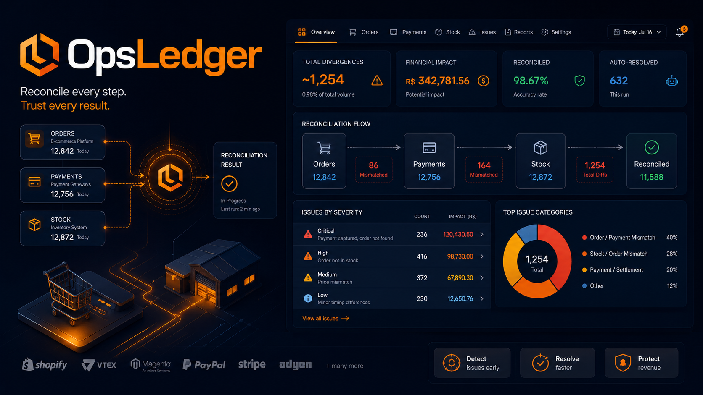
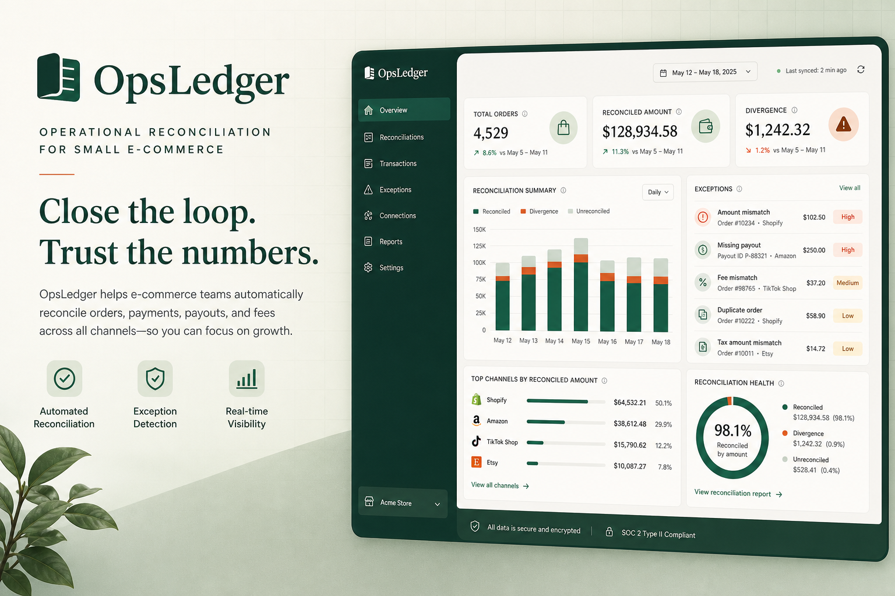
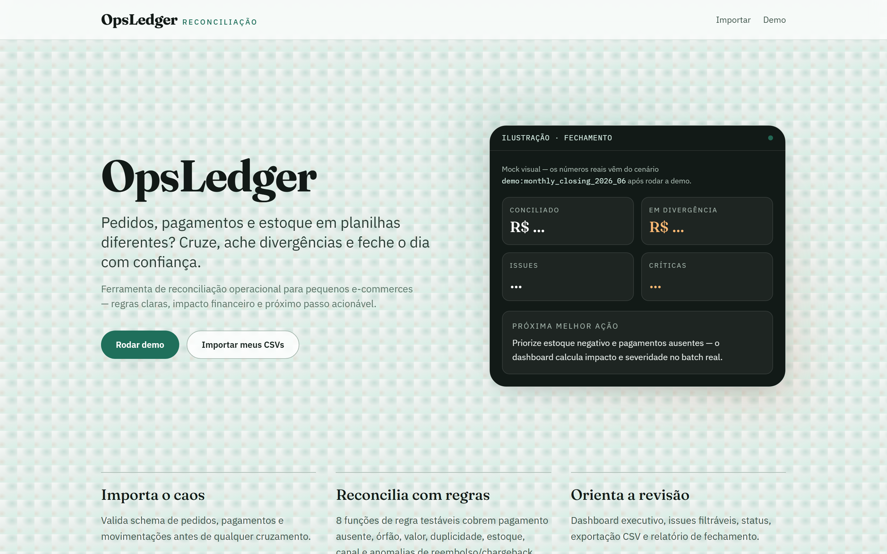
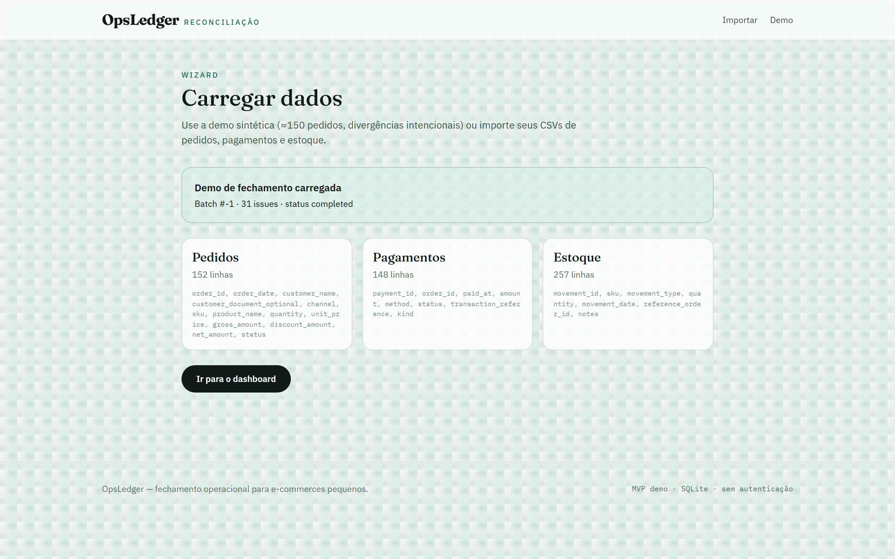
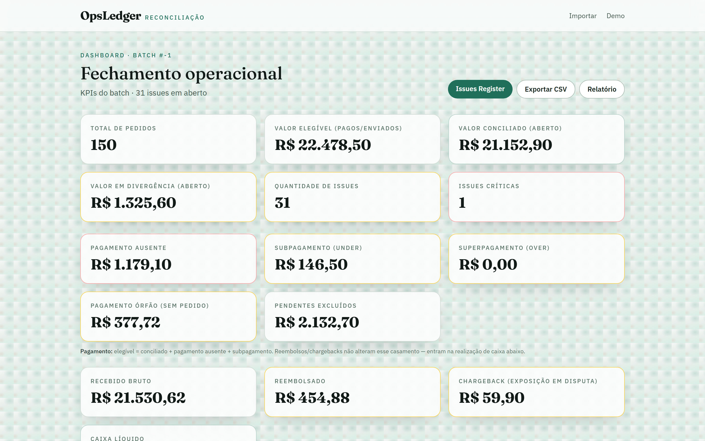
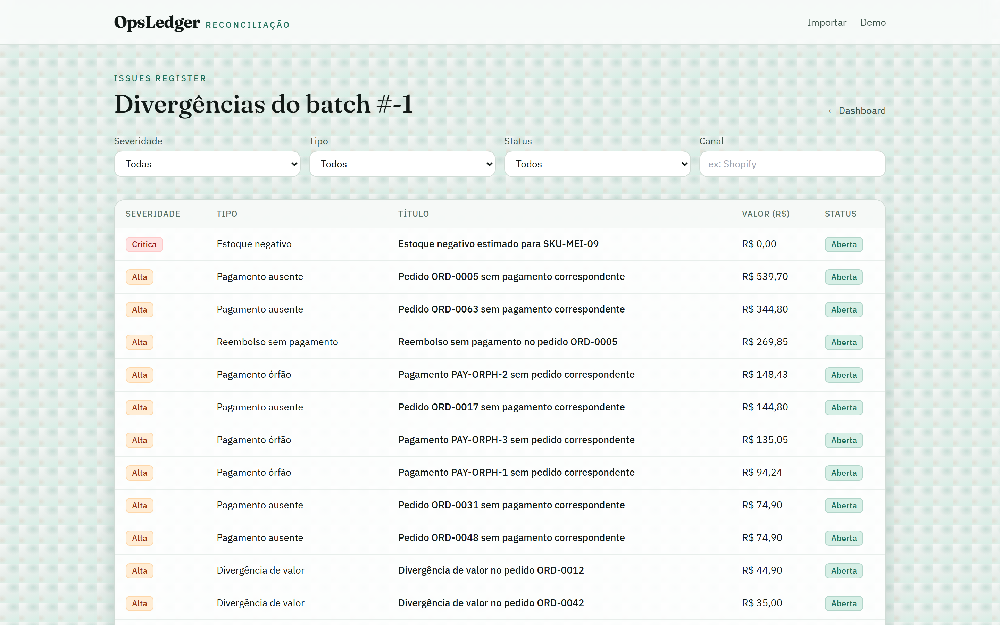
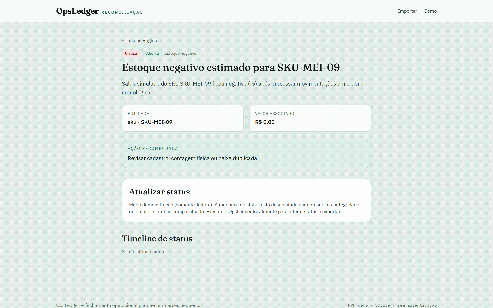
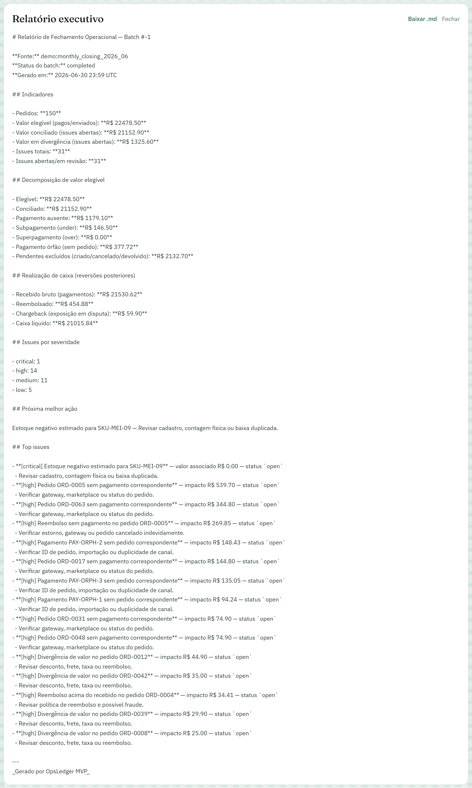

<div align="center">
  

  <h1>OpsLedger</h1>

  <p><strong>Reconciliação operacional para e-commerces pequenos: pedidos, pagamentos e estoque com regras testáveis.</strong></p>
  <p><strong>Operational reconciliation for small e-commerce: orders, payments and stock with testable rules.</strong></p>

  <p>
    <a href="#pt-br">PT-BR</a> ·
    <a href="#english">English</a> ·
    <a href="#live-demo">Live Demo</a> ·
    <a href="#stack">Stack</a> ·
    <a href="#architecture">Architecture</a> ·
    <a href="#quick-start">Quick Start</a> ·
    <a href="#author">Author</a>
  </p>

  <p>
    
    
    
    
    
    
    
  </p>

  <p>
    <a href="https://opsledger-app.vercel.app"><strong>Live Demo</strong></a> ·
    <a href="https://github.com/BarujaFe1/opsledger"><strong>Repo</strong></a> ·
    <a href="https://barujafe.vercel.app/"><strong>Portfolio</strong></a> ·
    <a href="https://www.linkedin.com/in/barujafe/"><strong>LinkedIn</strong></a>
  </p>
</div>

<p align="center">
  
</p>

> **Lab / demo notice:** OpsLedger is a **portfolio lab**, not a production ERP/WMS. The public demo is **stateless and read-only**: it reconstructs a fixed synthetic dataset in memory, exposes no upload or mutation endpoints, and masks structured PII in previews. The local workspace is single-user SQLite with honest limits (no auth, no multi-tenant).

---

## PT-BR

### Visão geral
O **OpsLedger** cruza pedidos, pagamentos e movimentações de estoque, detecta divergências com regras rastreáveis e orienta o fechamento operacional — do import ao relatório.

### Problema
Pequenos e-commerces fecham a semana com planilhas que quase batem: pagamentos órfãos, pedidos pagos sem captura, divergências de valor, duplicidades e baixas de estoque faltantes.

### Para quem
Analistas operacionais, founders de e-commerce pequeno/médio e profissionais de dados que precisam mostrar reconciliação aplicada (não só um dashboard).

### Funcionalidades
- Demo sintética one-click (**modo público:** stateless, read-only, dados sintéticos) ou import de CSVs local (pedidos / pagamentos / estoque)
- Engine de reconciliação com regras testáveis (qualidade, financeiro, estoque)
- Dashboard executivo (conciliado vs. em divergência, próxima ação)
- Issues register com detalhe, timeline de status e priorização por impacto
- Export CSV (com defesa contra injeção de fórmula) e relatório de fechamento
- Testes da engine (`pytest`) e da UI (`vitest`)

### Escopo e limites (honestos)
- **Não é produção:** sem autenticação, sem multiempresa
- SQLite single-user; no deploy Vercel o DB é `/tmp` (demo efêmera) — o modo público não persiste estado
- Estoque é saldo do batch, não WMS
- Sem integrações reais de marketplace/gateway
- Dinheiro em `Decimal` end-to-end (sem perda de precisão em splits / pagamentos parciais)
- Demo pública depende do deploy Vercel configurado neste repositório e é somente-leitura por design

---

## English

### Overview
**OpsLedger** joins orders, payments and stock movements, flags mismatches with traceable rules, and guides operational closing — from import to report.

### Problem
Small e-commerce teams close the week on spreadsheets that almost reconcile: orphan payments, paid orders without capture, amount mismatches, duplicates and missing stock deductions.

### Who it is for
Ops analysts, small/mid e-commerce founders, and data professionals who need applied reconciliation — not another vanity dashboard.

### Features
- One-click synthetic demo (**public mode:** stateless, read-only, synthetic data) or local CSV import (orders / payments / stock)
- Reconciliation engine with testable rules (quality, finance, stock)
- Executive dashboard (reconciled vs. open issues, next best action)
- Issues register with detail, status timeline and impact prioritization
- CSV export (with formula-injection defense) and closing report
- Engine tests (`pytest`) and UI tests (`vitest`)

### Scope and honest limits
- **Not production:** no auth, no multi-tenant
- SQLite single-user; on Vercel the DB is `/tmp` (ephemeral demo) — public mode is stateless
- Stock is batch balance, not a WMS
- No real marketplace/payment-gateway integrations
- Money is `Decimal` end-to-end (no precision loss on splits / partial payments)
- Public demo depends on the Vercel deploy in this repository and is read-only by design

---

## Live Demo

| Surface | URL |
|---|---|
| **Public lab** | [https://opsledger-app.vercel.app](https://opsledger-app.vercel.app) |
| **GitHub** | [https://github.com/BarujaFe1/opsledger](https://github.com/BarujaFe1/opsledger) |

**How to try:** open the demo → **Rodar demo** → inspect KPIs → open a high-severity issue → (local mode only) change status → export / closing report. In the public demo, upload and status changes are disabled by design.

---

## Screenshots

<table>
  <tr>
    <td width="50%"><br /><sub><strong>Home</strong></sub></td>
    <td width="50%"><br /><sub><strong>Wizard / demo</strong></sub></td>
  </tr>
  <tr>
    <td width="50%"><br /><sub><strong>Dashboard</strong></sub></td>
    <td width="50%"><br /><sub><strong>Issues</strong></sub></td>
  </tr>
  <tr>
    <td width="50%"><br /><sub><strong>Issue detail</strong></sub></td>
    <td width="50%"><br /><sub><strong>Closing report</strong></sub></td>
  </tr>
</table>

---

## Stack

| Layer | Technology |
|---|---|
| Web | Next.js 15, React 19, TypeScript, Tailwind, Recharts, TanStack Table, Zod, Vitest |
| API | FastAPI, Pydantic, Pandas, SQLAlchemy, SQLite, pytest |
| Ops | Docker Compose, Vercel (`vercel.json` frontend + FastAPI services) |

---

## Architecture

```txt
apps/
  api/          FastAPI — import batch, reconciliation engine, issues, reports
    app/reconciliation/
    app/services/
  web/          Next.js — landing, wizard, dashboard, issues, report UI
data/           demo / processed artifacts
assets/         icon, hero, screenshots
```

High-level flow: CSV/demo → schema validation → ImportBatch → rule engine → issues + KPIs → status updates → CSV export / closing report.

---

## Quick Start

**Prerequisites:** Node.js 20+, Python 3.12+, Git.

### Windows one-shot
```bash
.\start.bat
```
API on `:8000`, web on `:3000`.

### Manual

```bash
# API
cd apps/api
python -m venv .venv
.venv\Scripts\activate          # Windows
# source .venv/bin/activate     # Linux/macOS
pip install -r requirements.txt
python scripts/generate_demo_data.py
uvicorn app.main:app --reload --port 8000

# Web (other terminal)
cd apps/web
npm install
copy .env.example .env.local    # Windows
# cp .env.example .env.local    # Linux/macOS
npm run dev
```

### Docker (optional)
```bash
docker compose up --build
```

---

## Technical decisions

- **Rules as code + tests** so reconciliation is auditable, not a black-box spreadsheet formula
- **SQLite + SQLAlchemy** for a zero-friction local demo without cloud dependencies
- **Executive UX first** (KPIs, next action, issue severity) instead of raw tables only
- **Pandas in the API** for batch validation and joins that match real ops exports
- **Stateless public demo:** the read-only showcase reconstructs a fixed synthetic dataset in memory (no SQLite write, no uploads/mutations) so it is safe on serverless / multi-instance Vercel

### Testing

```bash
# Backend (pytest)
cd apps/api
.venv\Scripts\python -m pytest -q

# Frontend (Vitest + typecheck + lint + build)
cd apps/web
npm test
npm run typecheck
npm run lint
npm run build
```

CI: `.github/workflows/ci.yml` (pytest + vitest + lint + typecheck + build + Playwright E2E).

---

## Roadmap

- Auth + workspaces
- PostgreSQL + Alembic
- Configurable per-tenant rules
- Fuzzy matching across channels
- Alerts for critical issues
- Batch-to-batch comparison

---

## Author

**Felipe Alirio Baruja** — data / product / full-stack portfolio.

- Portfolio: [https://barujafe.vercel.app/](https://barujafe.vercel.app/)
- GitHub: [https://github.com/BarujaFe1](https://github.com/BarujaFe1)
- LinkedIn: [https://www.linkedin.com/in/barujafe/](https://www.linkedin.com/in/barujafe/)

---

## License

MIT — see [`LICENSE`](./LICENSE).

---

## Documentation

- [`HANDOFF_PORTFOLIO.md`](HANDOFF_PORTFOLIO.md) — portfolio-ready texts (LinkedIn, interview)
- [`docs/AUDIT_REPORT.md`](docs/AUDIT_REPORT.md) — quality-pass audit
- [`docs/HANDOFF.md`](docs/HANDOFF.md) — what changed in this pass
- [`docs/architecture.md`](docs/architecture.md) — architecture
- [`docs/TECHNICAL_DECISIONS.md`](docs/TECHNICAL_DECISIONS.md) — ADRs and trade-offs
- [`docs/TESTING.md`](docs/TESTING.md) — test pyramid
- [`docs/reconciliation-rules.md`](docs/reconciliation-rules.md) — detailed rules
- [`docs/data-dictionary.md`](docs/data-dictionary.md) — tables and CSV schemas
- [`docs/demo-story.md`](docs/demo-story.md) — demo narrative
- [`docs/deployment.md`](docs/deployment.md) — Vercel / Docker / local

---

## Portfolio value

OpsLedger demonstrates critical skills for **Analytics Engineering, Data/Ops Analytics and Full-Stack**:

- **Applied data product:** a real operational closing pain (spreadsheets that don't tie out)
- **Testable engine:** explicit rules with `pytest` — not just a dashboard
- **Modeling + SQLAlchemy:** batches, entities and status history
- **Executive UX:** investigation, prioritization and manager handoff
- **Security & demo hygiene:** stateless read-only public showcase, safe errors, PII allowlist, CSV/formula-injection defense, E2E coverage
- **Interview-grade docs:** README + HANDOFF + technical decisions

---

## Interview pitch

1. **30s — pain:** Marina closes the week with 3 CSVs that don't reconcile.
2. **Live demo:** home → Rodar demo → dashboard (divergence + next action).
3. **Critical issue:** open the detail, explain the rule and the recommended action.
4. **Code:** open the engine + a `pytest` test — highlight rule purity and the safe-error / PII / CSV-injection controls.
5. **Trade-offs:** SQLite `/tmp` on Vercel, no auth, read-only public demo — and what v1.1 looks like (Postgres, workspaces, Decimal-money already done).
6. **Positioning:** Analytics Engineering / Ops Analytics, not "fintech platform".

---

## Repository metadata

**About:** Operational reconciliation for small e-commerce: orders, payments and stock with testable rules, executive dashboard and closing report.

**Topics:** reconciliation, operations, ecommerce, data-quality, fastapi, nextjs, typescript, python, pandas, sqlite, dashboard, portfolio-project, csv-processing, analytics-engineering
